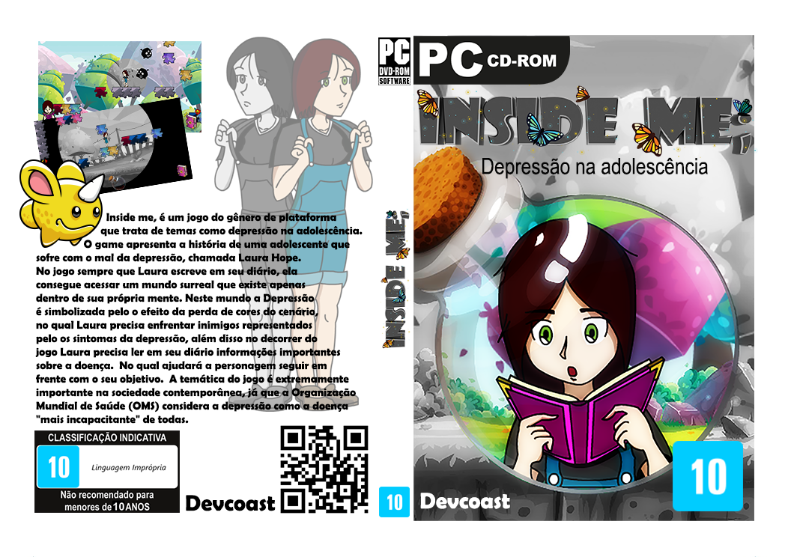

Este repositório registra o legado do projeto **Inside Me**, meu primeiro jogo desenvolvido com ActionScript 3 na plataforma Flash — tecnologias populares para desenvolvimento web e animações em meados de 2013, mas que hoje estão obsoletas.

Criado entre 2014 e 2016, **Inside Me** foi mais do que uma experiência de aprendizado técnico: teve como propósito principal **auxiliar adolescentes que enfrentam a depressão**, por meio de uma abordagem lúdica e educativa. O jogo foi apresentado em diversas feiras de tecnologia e recebeu reconhecimento de profissionais da área da saúde por seu impacto social.

---

<table>
  <tr>
    <td style="vertical-align: top; width: 60%;">
      
<h2>🎮 Sobre o Jogo</h2>

<ul>
  <li><strong>Gênero:</strong> Plataforma 2D</li>
  <li><strong>Personagem principal:</strong> <em>Laura Hope</em></li>
</ul>

A história acompanha <strong>Laura Hope</strong>, uma adolescente lidando com a depressão. Para escapar da sua realidade, ela mergulha em um mundo imaginário onde enfrenta desafios e perigos que simbolizam sua luta interna. A proposta do jogo é desmistificar a doença, trazendo informações relevantes ao longo da jornada, promovendo a conscientização e empatia.

    </td>
    <td>
      
    </td>
  </tr>
</table>

### 🛠 Desenvolvimento

- O projeto levou aproximadamente **dois anos** para ser concluído.  
- O tempo foi dividido entre programação, desenvolvimento da narrativa, testes e validação com **profissionais da saúde**.  
- Ao invés de utilizar engines prontas, optei por criar **minha própria engine** utilizando **ActionScript 3 (AS3)** e o **Adobe Flash**.

---

## 🔮 Futuro

Apesar das tecnologias utilizadas estarem ultrapassadas, desejo revisitar este projeto no futuro com uma nova abordagem:

- Migrar o jogo para tecnologias modernas, como **Unity** com **JavaScript** ou **C#**  
- Atualizar os gráficos e aprimorar a narrativa  
- Otimizar para **dispositivos móveis**  
- Manter o compromisso com a **conscientização sobre a depressão**

---

## ✨ Considerações Finais

**Inside Me** é uma aventura que transforma a compreensão sobre a depressão em uma experiência interativa e significativa.  

Obrigado por visitar este repositório!  
Sinta-se à vontade para explorar, comentar ou contribuir com ideias para uma futura versão.
